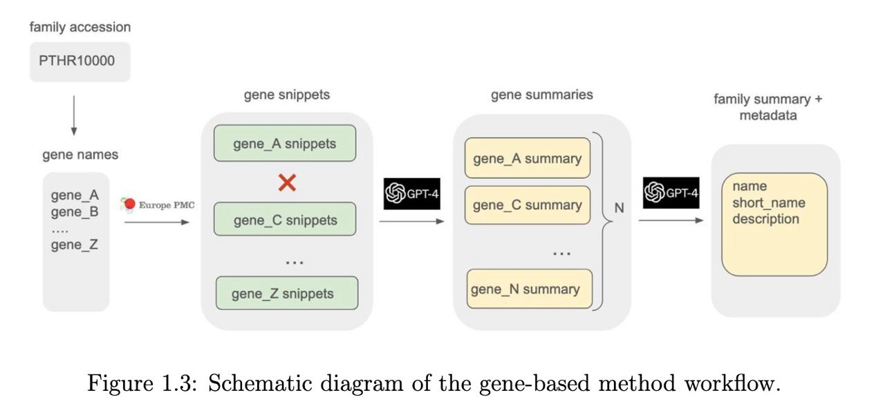
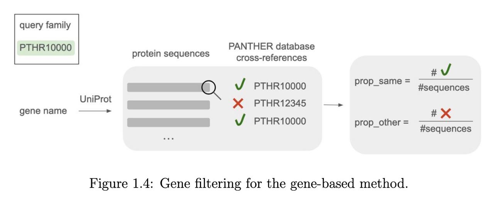

# ann-gene

Gene-based protein family annotation.

### Usage:

You need to add you OPENAI key first. In bash, do: ```export OPENAI_API_KEY=your-secret-key-here```

**(For the InterPro curators) Bash script on Codon cluster**

Bash script located at ```/hps/software/users/agb/research/irina/ann_gene.sh```. You can call it with the same arguments descriped below. You don't need to provide configs if you are using the bash script. 

Example usage: 
* ```./ann_gene.sh -q PTHR10000 -mode "from-fam-acc"```
* ```./ann_gene.sh -q your_family_name -mode "from-uniprot-list" -uniprot-list your_uniprot_list.txt```
* ```./ann_gene.sh -q your_family_name -mode "from-gene-list" -genes your_gene_list.txt```

**Python script**

Example usage:

```python3 main_gene_annot.py -mode "from-fam-acc" -q PTHR10000 -dir OUTPUT -run-gpt 1 -N 10```



### Arguments:

main:
* ```-mode, --mode```: running mode. Supports 3 modes:
  * * ```"from-fam-acc"```: receives family accession given in the argument ```-q```.
  * * ```"from-gene-list"```: receives the path to the list of genes in the argument ```-genes```. The list should be a TXT file, where each line contains tab-separated gene name, uniprot accession, (optional) "reviewed"/"unreviewed" status. If review status is provided, "reviewed" enries will be preferred for family summary. Requires ```-q``` argument to be passed, which would be used as a family name. ```-q``` may be a placeholder name.
  * * ```"from-uniprot-list"```: receives the path to the list of UniProt accessions in the argument ```-uniprot-list```. The list should be a TXT file, where each line conians a UniProt accession. Requires ```-q``` argument to be passed, which would be used as a family name. ```-q``` may be a placeholder name.

* ```-q, --query```: query family. For ```"from-fam-acc"```, will be used for gene search (PANTHER, InterPro, Pfam are supported). For ```"from-gene-list"```, ```"from-uniprot-list"```, can be a placeholder name.
* ```-dir, --dir-name```: output directory with per-family results and logs. Will be created if doesn't exist. ```default='output_per_query'```.
* ```'-o', '--text-output-dir-name'```: output directory with generated model responses. Will be created if doesn't exist. ```default='output'```
* ```-config, --config```: prompt config. Should be in json format. **Must be present in the working directory.**
  
  ```configs``` directory in this repo has the following configs:
  * * ```config.json```: simple config. The model will generate only family summary (no name/short_name)
  * * ```config-without-name.json```:  The model will generate only family summary (no name/short_name). Similar to previous config, but the prompt is written differently.
  * * ```config-desc-name-CoT.json```:  The model will generate family summary, name, short_name. Uses Chain of Thought approach for name/shart_name.
   
Mode-specific arguments:
* ```-genes, --gene-list```: **Required for ```"from-gene-list"``` mode.** The path to the TXT file containing genes for the family. Should be in format ```{gene_name}\t{uniprot_acc}``` or ```{gene_name}\t{uniprot_acc}\t{"reviewed"|"unreviewed"}"```.
* ```-uniprot-list, -uniprot-list```: **Required for ```"from-uniprot-list"``` mode.** The path to the TXT file containing UniProt accessions. Each line should contain one UniProt accession. 

The following can be left without modification:
* ```-F, --FORCE```: flag forcing to perform the gene search and snippet creating, even if the respective files already exist. You can leave it ```True```.
* ```-max, --max-pages-per-family```: maximum number of pages per family to parse. Each page has 25 genes, you might want to increase it to 100 or 1000.
* ```-max2, --max-pages-per-gene```: maximum number of EuropePMC pages per gene to parse
* ```-max3, --max-genes-each-type```: maximum number of genes of each type (reviewed, unreviewed, unknown review status).
* ```-s, --snippet-window-size```: snippet window size in characters, snippet will be 2 times longer

LLM-specific:
* ```-N1, --num-snippets-in-prompt```: number of snippets used in prompt to create a gene summary. Default 100 is ok.
* ```-N, --gpt4-n```: number of genes used in prompt for family summary. Default is 3, but I suggest using 10.
* ```-run-gpt, --run-gpt```: if API call to GPT should be ran. Set to ```True``` if you want to run it.

### Main functions and what they do

**pull_genes** -- creates a list of genes for the query family. Creates two files, which have the following format: ```{gene_name}\t{uniprot_acc}```
* ```genes_full_list_reviewed.txt```
* ```genes_full_list_unreviewed.txt```
  
**get_save_gene_snippets** -- searches for snippets mentioning the gene names in EuropePMC. Creates:
* Log file ```gene_snippet_search_log.json``` that records which genes have been already searched for. It becomes useful when gene search in EuropePMC breaks, because EuropePMC can't handle too many requests at one time. This ususlly happens when you're running the script for many families at once. So when you restart it, with ```-Force=True```, it will start the gene search not from the beginning of the gene list, but from the gene where it broke down. If you run the script for few families, you don't need to worry about this. To print the log, you can use ```get_log_stats``` from ```utils_snippet_search.py```.
* ```{dir_name}/{query}/snippets_per_gene```: directory with csv files for each gene (gene_name.csv) which contain the snippets
* ```genes_with_papers_list_all_review_status.txt```: file which contains information about genes for which snippets were found. Format: ```{gene_name}\t{num_papers}\t{num_snippets}```

**enumerate_snippets**: adds snippet IDs to the snippets.

**join_snippets_into_prompt**: uses snippets created by **get_save_gene_snippets** function to create gene-specific prompts for generating gene summary.

**select_genes**: performs filtering and sorting of the genes. 

Filtering is based on gene specificity to a family. See ```utils_famfilter.py``` for details. Graphical explanation below:



Sorting is based on
* reviewed/unreviewed status
* number of papers mentioning gene
* number of snippets mentioning gene

Creates files:
* ```selected_genes.txt```: has the sorted gene list which bypass the filtering.
* ```gene_spec_stats.tsv```: supplementary file, has information about specificity filtering. Format: ```{gene_name}\t{num_mentions}\{prop_true}\t{prop_false}```


### LLM-specific functions:

**get_gpt_genes_response**: creates gene summaries. With specific sample size (e.g. 10 genes) and specific model (e.g.o1) it creates only one file, e.g. ```per_gene_summaries_gpt-4o-2024-05-13_sample_10_4o.csv```

**get_gpt_family_response**: creates a family summary. Each run will create seperate 3 files with a timestamp:
* prompt file
* raw response file (raw generated text)
* pmid file (snippet IDs, derived from PMCIDs are substituted to PMIDs)

e.g.: ```PROMPT_family_text_sample_10_2025-01-18 12:57:27.txt```, ```RESPONSE_raw_gpt-4o-2024-05-13_sample_10_2025-01-18 12:57:27.txt```, ```RESPONSE_pmid_gpt-4o-2024-05-13_sample_10_2025-01-18 12:57:27.txt```

Output (RESPONSE) files will be:
* in family-specific directory
* in directory ```ALL_RESPONSES```. It gets copied here from family-specific directory.

### Additional

```utils_snippet_search.py``` has some helper functions, which can become useful if you are running the script for many families at once. For example, ```get_log_stats``` tracks how many genes are processed was the search sucessful or not; ```get_num_genes_with_snippets``` logs how many genes with snippets were found. Basically, this functions can help to understand if you need to rerun the snippet search for a family.

 
